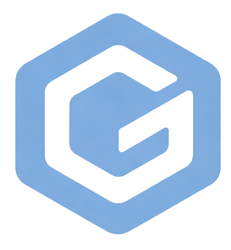

# Hi, I'm Igor! 👨‍💻
 

 
**Developer · Instructor · Network Engineer**
 
`🌍 Based in Latvia` · `🎓 Teaching since 2023` · `📡 Building mobile network labs`
 

---
 
## 🛠️ Tech Stack
 
### 🌐 Frontend

 
### 🔧 Backend & Languages

 
### 📡 Networking & Mobile

 
### 🎮 Game Dev

 
### 🧰 Tools & Environments

 
---
 
## 📡 Mobile Network Policy Lab
 
> 🔒 **Private repository** — [`mobile-network-policy-lab`](https://github.com/Grumz18/mobile-network-policy-lab)
 
Research project exploring adaptive mobile network policy enforcement using a multi-component architecture:
 
| Component | Tech | Description |
|-----------|------|-------------|
| **Android Client** | Kotlin | Mobile app with sing-box baseline persistence |
| **Server** | Go | Policy server skeleton and API |
| **Scripts** | PowerShell | Android prerequisite bootstrapping & automation |
| **Docs & Checkpoints** | Markdown | Continuation probes, governance docs, project state tracking |
 
**Stack:** Kotlin 72.8% · Java 16.1% · Go 8.4% · PowerShell 2.1%
 
---
 
## 🌐 Grummm Platform
 

  
  
  <a href="https://grummm.ru"><b>grummm.ru</b></a> — personal platform for posts, projects & runtime demos

 
Modular monolith combining a public showcase, a secure admin workspace, and runtime-ready modules — built with **React** + **ASP.NET Core 9** + **Docker**.
 
| Module | Description |
|--------|-------------|
| 📝 **[Posts](https://grummm.ru/posts)** | Editorial articles on architecture & product decisions |
| ✅ **[Task Tracker](https://grummm.ru/projects/task-tracker)** | Owner-scoped task board with secure private routes |
| 💰 **[Finance Tracker](https://grummm.ru/projects/finance-tracker)** | Budget, cashflow & KPI visualization for teams |
| 💬 **[Chat Module](https://grummm.ru/projects/chat-module)** | Internal messaging with moderation controls |
 
---
 
## 💡 About Me
 
- 🌐 Build responsive SPAs with **React** (Hooks, Router), semantic **HTML/CSS** (BEM, Flexbox, Grid)
- ⚙️ Work with modern **JavaScript (ES2015+)**: Promises, async/await, modular architecture
- 🏗️ Designed & built [**grummm.ru**](https://grummm.ru) — a modular monolith on **React** + **ASP.NET Core 9** + **Docker**
- 📡 Develop mobile network policy tools using **Kotlin**, **Go**, and **Java** (Android + server)
- 🔀 Use **Git** strictly — one commit per task
- 🤖 Automate workflows with **n8n** (Telegram, Google Sheets, mail APIs)
- 🖥️ Deploy sites manually, including SSL setup on remote servers
- 📊 Practical experience with **C++** (OOP, SFML, g++) and **Python** (bots, games, file systems)
- 🧩 Worked with **CMS**: WordPress, Moodle, Tilda
---
 
## 👨‍🏫 Teaching at Computer Academy «TOP»
 
Since **2023** I teach at **Computer Academy «TOP»** — both in-person and remotely (Yandex Telemost, MS Teams, Google Meet).
 
I cover **27 unique subjects** across multiple programs:
 

🌐 <b>Web Development</b> (5 subjects)

 
| Subject | Program | Status |
|---------|---------|--------|
| Web Design — Junior (HTML & CSS) | МКА | ✅ Done |
| HTML5 & CSS3 Web Page Development | ПКО Школьник | ✅ Done |
| JavaScript & jQuery | ПКО Школьник | ✅ Done |
| Web Apps with Angular & React | ПКО Школьник | ✅ Done |
| Python Web App Development | МКА | 🔄 Active |
 

🐍 <b>Python</b> (2 subjects)

 
| Subject | Program | Status |
|---------|---------|--------|
| Python — Junior | МКА | 🔄 Active |
| Python — Senior | МКА (Weekends) | 🔄 Active |
 

💻 <b>C++ & OOP</b> (1 subject)

 
| Subject | Program | Status |
|---------|---------|--------|
| OOP with C++ | ПКО Школьник | 🔄 Active |
 

🎮 <b>Game Development</b> (6 subjects)

 
| Subject | Program | Status |
|---------|---------|--------|
| Game Dev — Senior (Unity) | МКА | ✅ Done |
| Game Dev — Middle (Unreal Engine) | МКА | ✅ Done |
| Game Dev — Middle (Godot) | МКА (Weekends) | 🔄 Active |
| Game Dev — Junior (Construct) | МКА | 🔄 Active |
| Game Dev — Junior | МКА (Weekends) | 🔄 Active |
| Game Dev (Kodu) | МКА (Weekends) | ✅ Done |
 

🤖 <b>Robotics & Innovation</b> (3 subjects)

 
| Subject | Program | Status |
|---------|---------|--------|
| LEGO Robotics | МКА | ✅ Done |
| LEGO Robotics Pro | МКА | 🔄 Active |
| Innovative Technologies | МКА | ✅ Done |
 

🎨 <b>Creative & 3D</b> (4 subjects)

 
| Subject | Program | Status |
|---------|---------|--------|
| Photo Lab | МКА (Weekends) | ✅ Done |
| 3D Modeling & VR | МКА | ✅ Done |
| Animation & Cartoons | IT-Club | 🔄 Active |
| Engineers of the Future | IT-Club | ✅ Done |
 

🏕️ <b>Camps & Special Courses</b> (5 subjects)

 
| Subject | Program | Status |
|---------|---------|--------|
| Summer Camp 2024 | IT-Club | ✅ Done |
| Summer Camp 2024 IT-Mix (ages 7-8) | IT-Club | ✅ Done |
| Winter Camp (ages 7-10) | IT-Club | ✅ Done |
| Winter Camp (ages 11-14) | IT-Club | ✅ Done |
| Summer Camp 2021 | IT-Club | 🔄 Active |
 

🖥️ <b>PC Basics</b> (1 subject)

 
| Subject | Program | Status |
|---------|---------|--------|
| PC User | Individual Courses | 🔄 Active |
 

Also participate in **hackathons, camps, workshops** and off-site events.
 
---
 
## 📊 GitHub Stats
 

 

 

---
 

  <i>«One commit per task, one step at a time»</i>

 
